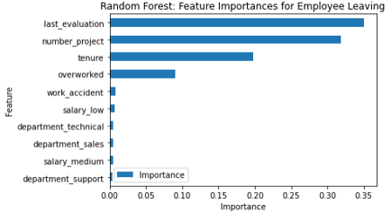

**<h1 style="text-align: left;"></h1>**
**<h1 style="text-align: center;"> GADA Capstone: Salifort-Motors Project</h1>**

## Contents
- [Contents](#contents)
- [Background](#background)
- [Understanding the business scenario and problem](#understanding-the-business-scenario-and-problem)
- [Issue/Problem](#issueproblem)
- [Response](#response)
- [Impact](#impact)
- [Feature Importance](#feature-importance)
- [Insights/next Steps](#insightsnext-steps)
- [Author](#author)
## Background
This is a capstone project for Google advanced Data Analytics(GADA) Professional Certificate. This capstone project is an opportunity to analyze a dataset and build predictive models that can provide insights to the Human Resources (HR) department of a large consulting firm. This capstone project follows the PACE workflow framework taught in this program. It will involve each of the four stages of PACE workflow framework. In my deliverables, I will include the model evaluation (and interpretation if applicable), a data visualization(s) of your choice that is directly related to the question you ask, ethical considerations, and the resources you used to troubleshoot and find answers or solutions.

####### ~~~~~~~~~~~~~~~~~~~~~~~~~~~~~~~~~~~~~~~~~~~~~~~~~~~~~~~~~~~~~~~ #######

## Understanding the business scenario and problem
The HR department at Salifort Motors wants to take some initiatives to improve employee satisfaction levels at the company. They collected data from employees, but now they don’t know what to do with it. They refer to you as a data analytics professional and ask you to provide data-driven suggestions based on your understanding of the data. They have the following question: what’s likely to make the employee leave the company?

Your goals in this project are to analyze the data collected by the HR department and to build a model that predicts whether or not an employee will leave the company.

If you can predict employees likely to quit, it might be possible to identify factors that contribute to their leaving. Because it is time-consuming and expensive to find, interview, and hire new employees, increasing employee retention will be beneficial to the company.

####### ~~~~~~~~~~~~~~~~~~~~~~~~~~~~~~~~~~~~~~~~~~~~~~~~~~~~~~~~~~~~~~~ #######

## Issue/Problem
Salifort Motors seeks to improve employee retention and answer the following question:

**What’s likely to make the employee leave the company?**

## Response
Since the variable we are seeking to predict is categorical, the team could build either a logistic regression or a tree-based machine learning model.

The random forest model slightly outperforms the decision tree model.

## Impact
This model helps predict whether an employee will leave and identify which factors are most influential. These insights can help HR make decisions to improve employee retention.

## Feature Importance

Barplot above shows the most relevant variables: `last_evaluation`, `number_project`,  `tenure` and `overworked`.

In the random forest model above, `last_evaluation`, `tenure`, `number_project`, `overworked`, `salary_low`, and `work_accident` have the highest importance. These variables are most helpful in predicting the outcome variable, `left`.

## Insights/next Steps
- Cap the number of projects that employees can work on.
- Consider promoting employees who have been with the company for at least four years, or conduct further investigation about why four-year tenured employees are so dissatisfied.
- Either reward employees for working longer hours, or don't require them to do so.
- If employees aren't familiar with the company's overtime pay policies, inform them about this. If the expectations around workload and time off aren't explicit, make them clear.
- Hold company-wide and within-team discussions to understand and address the company work culture, across the board and in specific contexts.
- High evaluation scores should not be reserved for employees who work 200+ hours per month. Consider a proportionate scale for rewarding employees who contribute more/put in more effort.

####### ~~~~~~~~~~~~~~~~~~~~~~~~~~~~~~~~~~~~~~~~~~~~~~~~~~~~~~~~~~~~~~~ #######

## Author
>**Muhammad Umair Salim**
\
Data Science Certifications
>- IBM Data Science Professional Certificate
>- Google Advanced Data Analytics Professional Certificate
>- UoA Faislabad Data Science Professional Certificate
>- UoM Statistics with Python Specialization
\
[Email](umairsalim@datistan.onmicrosoft.com)
\
[Kaggle](https://www.kaggle.com/umairsalim219)
\
[LinkedIn](https://www.linkedin.com/in/muhammad-umair-salim-a0401a256/)
\
[GitHub](https://github.com/Umair-Salim)
\
[Twitter](https://twitter.com/UmairSalim5)

